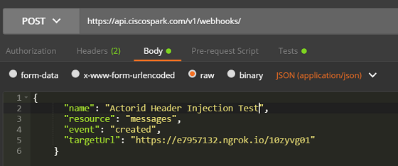
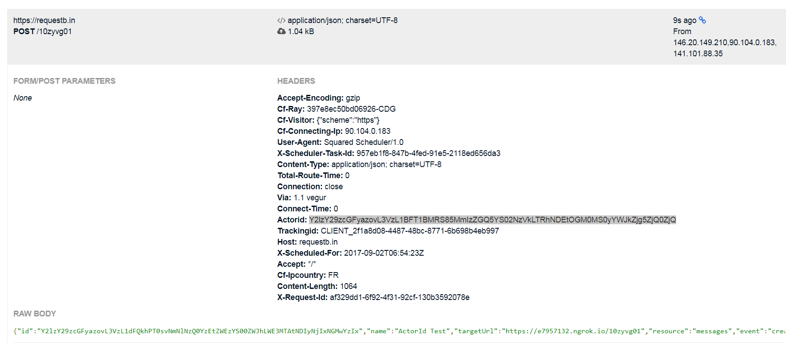

# Load Balancing Affinity for Cisco Spark Bots

A reverse proxy to enables LB affinity (application layer persistance) based on the [actorId property of the Webhook event](https://developer.ciscospark.com/webhooks-explained.html#handling-requests-from-spark) (ie, the personId of the Cisco Spark user interacting with the bot).

The typical use case is to scale stateful Cisco Spark bots, by ensuring the Webhook events are rooted to the bot instance holding context for a group of users interacting with the bot.

The proxy accepts different configuration modes:

- **Affinity cookie**: a cookie is setup by the load balancer in a Webhook HTTP response. The proxy associates the 'actorId' of the Webhook event being processed with the cookie. Next time the same 'actorId' is received, the proxy injects the cookie before forwarding the request to the load balancer. The LB then routes the request to the right bot instance.

- **ActorId injection**: the proxy looks for an 'actorId' property in the incoming Webhook event payload. If found, the proxy add a configurable 'Actorid' HTTP header. The proxy then forwards the HTTP request to a target URL (generally a cluster of Cisco Spark Bots sitting behind a load balancer). Choose this mode if your LB can persist sessions and route traffic based on the ActorId.


## How to use

The proxy forwards to the the Load Balancer specified via the TARGET_URL env variable.

**Instructions on Mac/Linux**
```shell
git clone https://github.com/ObjectIsAdvantag/webhook-affinity
cd webhook-affinity
npm install
DEBUG=injector TARGET_URL=https://your-bot-server node server.js
```

**Instructions on Windows**
```shell
git clone https://github.com/ObjectIsAdvantag/webhook-affinity
cd webhook-affinity
npm install
set TARGET_URL=https://your-bot-server
set DEBUG=injector
node server.js
```

## Testing 'ActorId injection' from your local machine

- Create a [test endpoint](https://requestb.in) to receive Cisco Spark webhook notifications
   - Example: https://requestb.in/10zyvg01

- Run the proxy on your local machine with Requestb.in as the destination endpoint. 
   - Make sure you specify 'https://requestb.in' and not the full path to your requestb.in endpoint, ie no suffix as show below:
    
   ```shell
   cd webhook-affinity
   TARGET_URL=https://requestb.in  node server.js
   ```

- Expose your local proxy via ngrok. Your proxy is running on port 9090 by default, for which ngrok creates a temporary public endpoint thanks to the command below:
   
   ```shell
   ngrok http 9090
   ```

- Create a Webhook for (Messages/Created) events with name "Actorid Injection Test" from a Bot Account token and pointing to the ngrok URL, suffixed with your requestb.in identifier. 
   - Example: https://e7957132.ngrok.io/10zyvg01
   
   

- Now interact with the bot in a Cisco Spark space and check the enriched JSON payload at requestb.in's inspect URL. 
   - Example: https://requestb.in/10zyvg01?inspect
   
   


## Architecture

Cisco Spark webhooks send notification events via POST requests, with the [JSON payload documented here](https://developer.ciscospark.com/webhooks-explained.html#handling-requests-from-spark).

In order to enable LB affinity, a proxy is responsible for extracting the actorId of the incoming payload from Cisco Spark, and maintain sessions based on this actorId, or inject headers.

> actorId is the personId of the user that caused the webhook to be sent. For example, on a messsage created webhook, the author of the message will be the actorId. On a membership deleted webhook, the actor is the person who removed a user from a room.

```json
{
  "id":"Y2lzY29zcGFyazovL3VzL1dFQkhPT0svZjRlNjA1NjAtNjYwMi00ZmIwLWEyNWEtOTQ5ODgxNjA5NDk3",
  "name":"Guild Chat to http://requestb.in/1jw0w3x1",
  "resource":"messages",
  "event":"created",
  "filter":"roomId=Y2lzY29zcGFyazovL3VzL1JPT00vY2RlMWRkNDAtMmYwZC0xMWU1LWJhOWMtN2I2NTU2ZDIyMDdi",
  "orgId": "Y2lzY29zcGFyazovL3VzL09SR0FOSVpBVElPTi8xZWI2NWZkZi05NjQzLTQxN2YtOTk3NC1hZDcyY2FlMGUxMGY",
  "createdBy": "Y2lzY29zcGFyazovL3VzL1BFT1BMRS8xZjdkZTVjYi04NTYxLTQ2NzEtYmMwMy1iYzk3NDMxNDQ0MmQ",
  "appId": "Y2lzY29zcGFyazovL3VzL0FQUExJQ0FUSU9OL0MyNzljYjMwYzAyOTE4MGJiNGJkYWViYjA2MWI3OTY1Y2RhMzliNjAyOTdjODUwM2YyNjZhYmY2NmM5OTllYzFm",
  "ownedBy": "creator",
  "status": "active",
  "actorId": "Y2lzY29zcGFyazovL3VzL1BFT1BMRS8xZjdkZTVjYi04NTYxLTQ2NzEtYmMwMy1iYzk3NDMxNDQ0MmQ",
  "data":{
    "id":"Y2lzY29zcGFyazovL3VzL01FU1NBR0UvMzIzZWUyZjAtOWFhZC0xMWU1LTg1YmYtMWRhZjhkNDJlZjlj",
    "roomId":"Y2lzY29zcGFyazovL3VzL1JPT00vY2RlMWRkNDAtMmYwZC0xMWU1LWJhOWMtN2I2NTU2ZDIyMDdi",
    "personId":"Y2lzY29zcGFyazovL3VzL1BFT1BMRS9lM2EyNjA4OC1hNmRiLTQxZjgtOTliMC1hNTEyMzkyYzAwOTg",
    "personEmail":"person@example.com",
    "created":"2015-12-04T17:33:56.767Z"
  }
}
``` 
